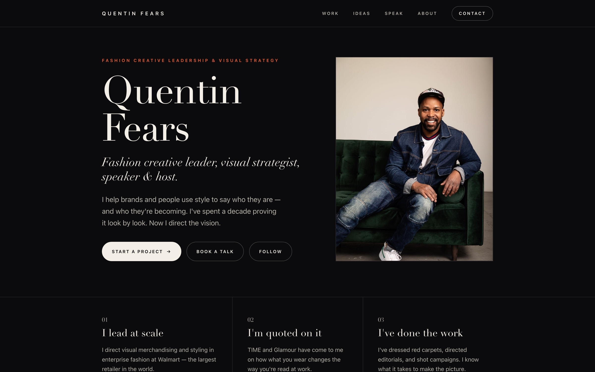

# quentinfears.com — repositioned site


A rebuild of Quentin Fears' website that keeps the **visual style** of the current
site (dark, editorial, image-forward, premium) while repositioning the **content**
from "celebrity & personal stylist" to **fashion creative leader, visual strategist,
speaker, and host**, per the repositioning brief.



> The home page as it renders today. Photography and video are placed through a simple
> image-slot system (see [ASSETS.md](ASSETS.md)); any slot still without a file falls
> back to a labeled placeholder, so the layout stays intact at every stage of asset
> collection.

See **[PROPOSAL.md](PROPOSAL.md)** for the proposal (what stays, what changes, and why)
and **[ASSETS.md](ASSETS.md)** for the image/media manifest.

## Structure

The site is built with [Astro](https://astro.build) and its content is edited
through a [Keystatic](https://keystatic.com) admin (both free and open source). The
design is unchanged — Astro renders the same markup and reuses the same CSS/JS.

```
content/*.yaml          The editable content (words + image paths), one file per page
keystatic.config.ts     Content schema + the /keystatic admin UI
src/pages/*.astro       Home, Work, Ideas, Speak, About, Contact (render the content)
src/layouts/BaseLayout.astro   Shared <head>: SEO, Open Graph, JSON-LD, gate, favicons
src/components/*.astro  Header, Footer, Cta
public/assets/css/style.css    Design system (self-contained, no external fonts)
public/assets/js/*.js   Mobile nav, scroll reveal, gallery lightbox, gate, footer year
public/assets/img/      Photos (see ASSETS.md); everything in public/ ships verbatim
dist/                   Build output (git-ignored): the static site that deploys
```

See [docs/astro-keystatic-migration.md](docs/astro-keystatic-migration.md) for the
architecture and rationale.

## Editing content (no code)

```bash
npm install      # once
npm run dev      # then open http://localhost:4321/keystatic
```

The admin has a form for every page: headlines, proof points, case studies,
testimonials, talk topics, galleries, the timeline, contact inquiry types, and the
per-page SEO text. Saving writes the `content/*.yaml` files; commit and push to
publish. You can also edit those YAML files directly.

**Hosted admin (edit from a browser, no dev server):** deploy the admin to a free
Netlify project (`npm run build:admin`) so a non-technical editor signs in with
GitHub and edits in forms — Save commits to the repo and the public site redeploys.
Setup is in [docs/hosted-admin.md](docs/hosted-admin.md).

## Design

- **Style continuity:** near-black canvas, warm off-white ink, high-contrast fashion
  serif for display (Didone/Bodoni register via a resilient system stack), clean
  grotesque sans for UI, all-caps letter-spaced labels, and a restrained fuchsia accent.
- **Self-contained:** no external fonts, scripts, or CDNs — works offline and inside a
  strict CSP. Fonts degrade gracefully (Didot → Bodoni → Playfair → Georgia).
- **Responsive & accessible:** mobile nav, skip link, reduced-motion support, keyboard-
  friendly forms, semantic landmarks.
- **Image slots:** each `` reveals a labeled placeholder until the real file is
  added, so the site looks designed at every stage of asset collection.

## Preview locally

```bash
npm run dev       # http://localhost:4321 (site) and /keystatic (admin)
# or preview the production build:
npm run build && npm run preview
```

## Validate

Two dependency-free checks keep pages, links, galleries, and SEO in sync. They run
against the build output (`dist/`):

```bash
npm run build            # produces dist/
npm run validate         # runs both checks on dist/
# or individually:
python3 tools/validate_site.py dist
python3 tools/seo_check.py dist
```

`validate_site.py` verifies internal links and anchors resolve, gallery keys match
their JSON, and no template boilerplate slipped in. `seo_check.py` verifies the SEO
invariants (title/description, canonical, Open Graph, JSON-LD, sitemap membership,
gate ↔ indexing coupling). Both default to `dist/` when it exists. CI builds and runs
both on every push and pull request (see [`.github/workflows/ci.yml`](.github/workflows/ci.yml)).

## Deploy

`npm run build` emits a static site to `dist/` — deployable to any static host
(GitHub Pages, Netlify, Vercel, Cloudflare Pages). The Keystatic admin is a local
editing tool and is not part of the deployed site.

This repo is wired for **GitHub Pages**: [`.github/workflows/deploy.yml`](.github/workflows/deploy.yml)
builds and publishes `dist/` on every push to `main` (currently at
`https://obartra.github.io/quentin/`, behind a lightweight access gate while it's
pre-launch).

## Before launch — checklist

- [ ] Add real images to `assets/img/` (see `ASSETS.md`), especially the leader-mode hero portrait.
- [ ] Embed the two-minute speaking reel on `speak.html`.
- [ ] Replace testimonial quotes with verbatim wording from the existing site.
- [ ] Have Quentin's manager/comms review the Walmart bio language.
- [ ] Set the contact form endpoint and update the contact email.
- [x] Set the real domain in the `og:` / canonical / sitemap tags (`https://quentinfears.com`). If the
      site launches on a different domain, find-and-replace `quentinfears.com` across the HTML,
      `robots.txt`, and `sitemap.xml`.
- [ ] **Flip indexing on at launch.** While the password gate is up the pages are
      `robots: noindex, nofollow` (a private preview should not be indexed). When the gate
      comes off, restore `index, follow, max-image-preview:large, max-snippet:-1, max-video-preview:-1`
      on all six pages (the exact string is in an HTML comment next to each `robots` tag).
- [ ] Submit `sitemap.xml` in Google Search Console and Bing Webmaster Tools after launch.
- [ ] Optional: replace the generated `assets/img/og-cover.jpg` share card and the JSON-LD
      `Person.image` with a real photo of Quentin once the leader-mode portrait exists.

## SEO

Technical SEO is built in and self-contained (no external calls):

- **Per page:** unique `<title>` + meta description, canonical URL, Open Graph + Twitter Card
  tags, and a `robots` directive. While the site is behind the password gate this is
  `noindex, nofollow`; flip it to `index, follow, max-image-preview:large` at launch.
- **Structured data:** JSON-LD on every page — a shared `Person` entity (`#person`) plus
  `WebSite`, `ProfilePage` (about), `ContactPage` (contact), `CollectionPage` (work), and
  `BreadcrumbList` on subpages.
- **Social share card:** `assets/img/og-cover.jpg` (1200×630), generated from the brand palette.
- **Icons:** `favicon.svg` (scalable), `favicon.ico`, `apple-touch-icon.png`, and PWA icons via
  `site.webmanifest`.
- **Crawl:** `robots.txt` points at `sitemap.xml`, which lists all six pages.

Everything is keyed to `https://quentinfears.com`; change that string if the domain differs.
